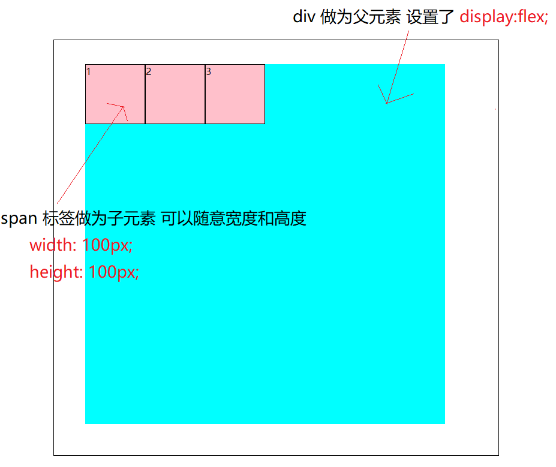
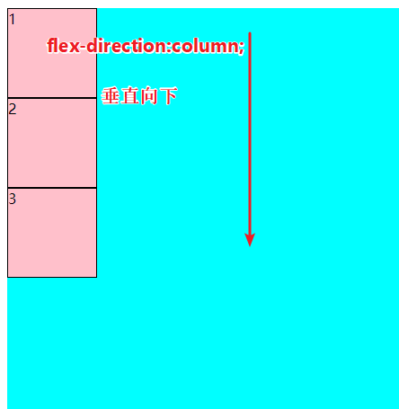
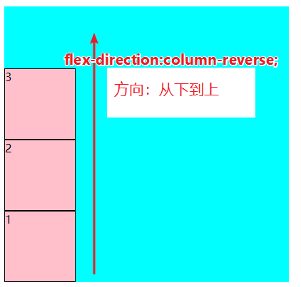
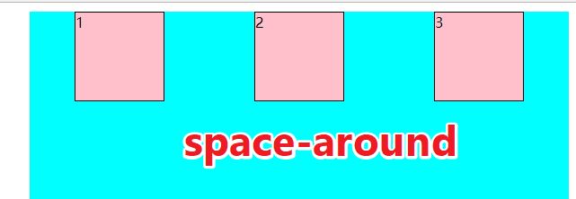
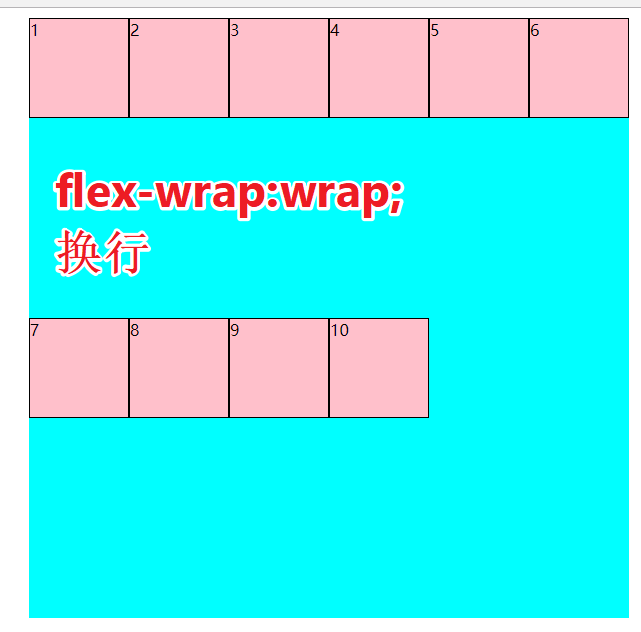
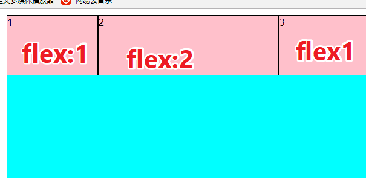

# 携程旅游h5移动端首页

<!--  -->


目录：

[1.学习目标](#1--学习目标)

[2.flex弹性布局](#2--flex弹性布局)

[3.初体验](#3--初体验)

[4.父项](#4--父项)

[5.子项](#5-子项)

[6.弹性布局小结](#6-弹性布局小结)

[7.background-size属性](#7-background-size属性)

# h5第四天

## 1  学习目标

- 理解
  - 弹性盒子
- 应用
  - 携程旅游案例

## 2  flex弹性布局

- 传统布局 兼容性好  但是繁琐
- 弹性布局  操作方便  主要用于移动端
- 伸缩布局=弹性布局=伸缩盒子=弹性盒子=flex布局

## 3  初体验

1. 给父盒子 div 设置 `display:flex;`，即可将其变为弹性布局
2. 子元素span可以随意设置宽高，不再受显示模式的限制(如行内span元素也可以设置宽高)

```css
<style>
    * {
      margin: 0;
      padding: 0;
      box-sizing: border-box;
    }
    div {
      width: 600px;
      height: 600px;
      margin: 10px auto;
      background-color: aqua;
      /* 父项设置flex布局 */
      display: flex;
    }
    /* span做为子项 */
    span {
      background-color: pink;
      border: 1px solid #000;
      /* 子项不再分行内或者块级 直接设置宽高即可 */
      width: 100px;
      height: 100px;
    }
  </style>
</head>
<body>
  <div>
    <span>1</span>
    <span>2</span>
    <span>3</span>
  </div>
</body>
```




以下设置属性的时候，我们时分为对父元素设置和对子元素设置两种方式。

## 4  父项

以下6个属性时对父元素设置的

1. `flex-direction`设置主轴的方向
2. `justify-content`设置主轴上子元素的排列方式
3. `flex-wrap`设置子元素是否换行
4. `align-content`设置侧轴上的子元素的排列方式(多行)
5. `align-items`设置侧轴上的子元素排列方式(单行)
6. `flex-flow`复合属性，相当于同时设置了 flex-direction 和 flex-wrap


### 4.1  flex-direction 设置主轴的方向

在flex布局中，时分为主轴和侧轴两个方向，同样的叫法有：行和列、x轴 和 y轴

- 主轴方向就是x轴方向--水平向右
- 侧轴方向就是y轴方向--水平向下


如上面的案例：子项默认就是从左到右排列的。

- **flex-direction:row;** row 就是默认值，从左到右


- **flex-direction:row-reverse;**从右到左


- **flex-direction:column;**从上到下



- **flex-direction:column-reverse;**从下到上



### 4.2 justify-content 设置主轴上的子元素排列方式

直接上图

- `justufgy-content:flex-start` 默认值
- `justify-content:flex-end;`从尾部开始排列，要注意与 `flex-direction-reverse;`的区别


- `justify-content:center;`挤在一起居中


- `justify-content:space-around;`平分剩余空间



- `justify-content:space-between;`先两边再平分剩余空间


### 4.3 flex-wrap设置子元素是否换行

flex布局默认是不换行的，把span标签的个数变成100个试试

默认

> flex-wrap:no-wrap;


想要换行，只能手动指定

> flex-wrap:wrap;



### 4.4 align-content 设置侧轴上的子元素的排列方式(多行)

设置子项在侧轴上的排列方式，并且只能用于子项出现换行的情况， **在单行下是没有效果的！**

- align-content:flex-start;在侧轴的头部开始排列


- align-content-end;在侧轴的尾部开始排列


- align-content:flex-center;在侧轴中间显示


- align-content-around;子项在侧轴平分剩余空间


- align-content:space-between;子项在侧轴，先分布在两头，再平分剩余空间


- align-content:stretch;设置子项元素高度平分父元素高度(当子项设了高度的时候--无效)

  在css中先把子项高度去掉

  ```css
   /* 为了让 父项的align-content:stretch;有效 注释 子项的高度 */
   /* height: 100px; */
  ```

  在父项中加入

  ```css
  /* 子项高度平分父元素的高度*/
  align-content:stretch;
  ```

  

- align-content:normal;默认值

### 4.5 align-items 设置侧轴上的子元素排列方式(单行)

该属性是控制子项在侧轴(默认是y轴)上的排列方式，在子项为单项的时候使用

它的参数意思可以参照之前的解释

- align-items:flex-start;
- align-items:flex-end;
- align-items:center;
- align-items:stretch;

### 4.6 align-content和align-items的区别

1. align-items可以用于单行和多行，但是设置多行的参数没有align-content多
2. align-content只能用于多行，不能用于单行
3. 为了方便记忆，可以记为字母数少的设置单行，字母多的设置多行

## 5 子项

### 5.1 align-self控制子项自己在侧轴上的排列方式

**align-self的优先级比align-items,align-content高**

1. - 在父项上设置:侧轴子项排列方式居中 `align-items:center;`
2. 在第二个子项上，设置自己在侧轴上的排列方式`align-self:flex-end;`

```css
<style>
    * {
      margin: 0;
      padding: 0;
      box-sizing: border-box;
    }

    div {
      width: 600px;
      height: 600px;
      margin: 10px auto;
      background-color: aqua;
      display: flex;
      /*父元素 设置侧轴子项排列方式 居中 */
      align-items: center;
    }
    span {
      background-color: pink;
      border: 1px solid #000;
      width: 100px;
      height: 100px;
    }
    span:nth-child(2) {
      /* 设置自己在侧轴上的排列方式 */
      align-self: flex-end;
    }
  </style>
</head>
<body>
  <div>
    <span>1</span>
    <span>2</span>
    <span>3</span>
  </div>
</body>
```


其它参数的设置如下

1. 参数基本和align-items一样
2. flex-start
3. flex-end
4. center
5. stretch

### 5.2 order 设置子项之间的排列顺序

默认值都是0，谁的order值越小，谁就越靠前


### 5.3 flex 设置子项宽度占父元素宽度的比例

**当子项指定了width时无效**

例子一

设置  **每一个子项父元素的宽度**

```css
 <style>
    * {
      margin: 0;
      padding: 0;
      box-sizing: border-box;
    }
    div {
      width: 600px;
      height: 600px;
      margin: 10px auto;
      background-color: aqua;
      display: flex;
    }
    span {
      background-color: pink;
      border: 1px solid #000;
      height: 100px;
      /* 不要指定width属性 */
      /* width: 100px; */
      flex: 1;
    }
  </style>
</head>

<body>
  <div>
    <span>1</span>
    <span>2</span>
    <span>3</span>
  </div>
</body>
```


**计算方式**

当设置子项的`flex:1;`时，假设有n个子项，每一个子项各占父元素的 **1/n**

> 子项的宽度 = 父元素宽度 *（ 子项的flex / 总的flex数 ） 
>
> = >
>
> 子项的宽度=父元素宽度 *（1 / n） 


例子二

假设一共有三个子项，第一个子项设置`flex:2`其他都为`flex:1`第一个子项的宽度应该是其他子项的两倍

```css
<style>
    * {
      margin: 0;
      padding: 0;
      box-sizing: border-box;
    }
    div {
      width: 600px;
      height: 600px;
      margin: 10px auto;
      background-color: aqua;
      display: flex;
    }
    span {
      background-color: pink;
      border: 1px solid #000;
      height: 100px;
      /* 不要指定width属性 */
      /* width: 100px; */
      flex: 1;
    }
    span:nth-child(1){
      flex: 2;
    }
  </style>
</head>

<body>
  <div>
    <span>1</span>
    <span>2</span>
    <span>3</span>
  </div>
</body>
```



### 5.4 其他

1. flex-grow 了解即可，可以自行查 css.chm文档
2. flex-shrink 了解即可 了解即可  可以自行查 css.chm 文档
3. flex-basis 了解即可 了解即可  可以自行查 css.chm 文档

## 6 弹性布局小结

- 子项可以直接设置宽度和高度
- 子项不受浮动影响，但是受定位影响
- 在移动端布局时，传统布局和弹性布局，哪种方便就使用哪种。


## 7 background-size属性

```css
div {
            display: flex;
            flex-direction: column;
            align-items: center;
            justify-content: space-around;
            flex:1; 
            padding: 8px 0;
            background-color: #fff;
            color: #000;
            >i {
                width: 16px;
                height: 17px;
                background: url("../img/un_ico_home_v620.png") -60px -154px;
                background-size: 104px 328px;
            }
            span {
                font-size: 12px;
            }
```

适用于这次运用了弹性布局的项目中，但必须记住，先声明background,再声明background-size